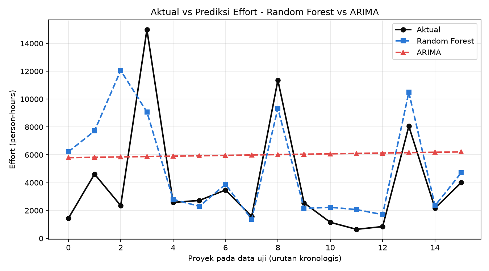
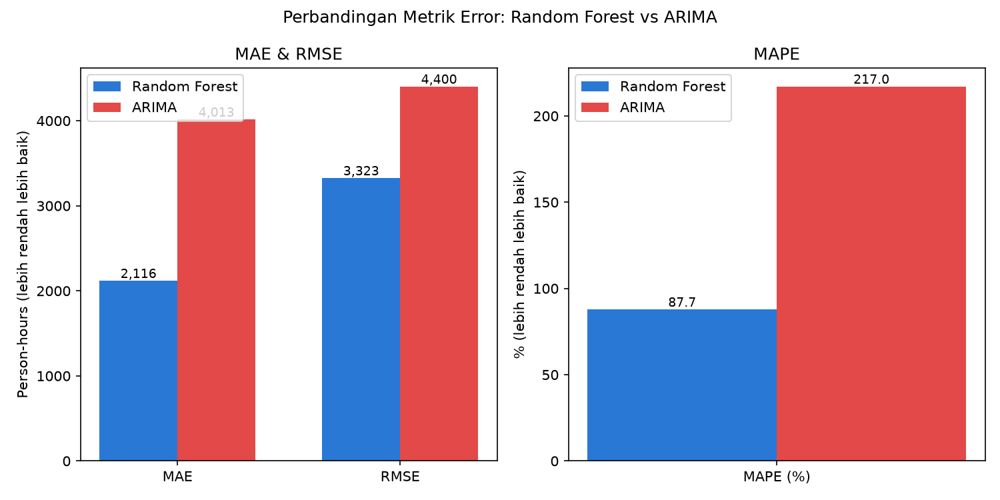
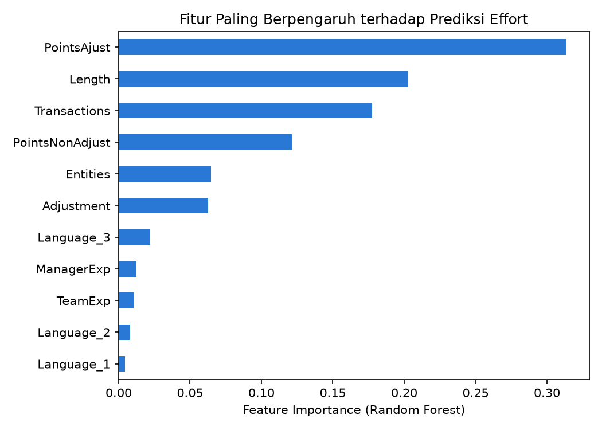

# Perbandingan Random Forest vs ARIMA pada Dataset Desharnais

## 1. Latar Belakang

Dataset **Desharnais** berisi 81 proyek pengembangan software dari
perusahaan-perusahaan Kanada (1982-1988), dengan atribut ukuran &
kompleksitas proyek (jumlah transaksi, entitas, function points, dsb.)
serta target **Effort** (usaha proyek dalam person-hours). Dataset ini
banyak dipakai sebagai benchmark riset *software effort estimation*.

Penting dicatat: Desharnais **bukan** dataset time series dalam arti
sebenarnya — setiap baris adalah proyek independen, bukan pengamatan
berurutan dari satu entitas yang sama. Satu-satunya penanda waktu adalah
`YearEnd` (tahun proyek selesai). Beberapa penelitian (mis. Sarro et al.,
"Testing the Stationarity Assumption in Software Effort Estimation
Datasets") memang mengurutkan proyek berdasarkan tahun untuk menguji
apakah pendekatan time series masuk akal pada data semacam ini.

Studi ini membandingkan dua pendekatan untuk memprediksi Effort:

1. **Random Forest** — regresi berbasis fitur (ukuran & kompleksitas proyek).
2. **ARIMA** — model time series univariat, memperlakukan Effort sebagai
   deret yang diurutkan berdasarkan `YearEnd`.

## 2. Metodologi

- **Pembersihan data**: 4 proyek dengan nilai hilang (`TeamExp`/`ManagerExp`
  = -1) dibuang, menyisakan **77 proyek** — sesuai praktik umum pada
  literatur (dataset asli memang punya 4 data hilang).
- **Pembagian data**: proyek diurutkan kronologis berdasarkan `YearEnd`
  (id sebagai pemecah seri), lalu dibagi menjadi:
  - **Train**: 61 proyek pertama (~79%)
  - **Test**: 16 proyek terakhir (~21%) — dipakai sebagai *holdout*
    kronologis untuk **kedua model**, agar perbandingan adil (keduanya
    diuji memprediksi proyek "masa depan" yang sama, bukan pembagian acak).
- **Random Forest**: `RandomForestRegressor` (500 trees, max_depth=6)
  dilatih menggunakan fitur `TeamExp, ManagerExp, Length, Transactions,
  Entities, PointsNonAdjust, Adjustment, PointsAjust, Language` untuk
  memprediksi `Effort`.
- **ARIMA**: dilatih hanya pada deret `Effort` train (univariat, tanpa
  fitur lain), order `(p,d,q)` dipilih otomatis lewat grid search AIC
  (`p,q` ∈ 0..3, `d` ∈ 0..2), lalu di-forecast sejauh 16 langkah ke depan.
- **Metrik evaluasi**: MAE, RMSE, MAPE, R² — dihitung pada 16 proyek data uji.

## 3. Hasil

| Metrik      | Random Forest | ARIMA        |
|-------------|---------------:|-------------:|
| MAE         | **2.115,8**    | 4.012,7      |
| RMSE        | **3.323,1**    | 4.400,1      |
| MAPE (%)    | **87,7%**      | 217,0%       |
| R²          | **0,280**      | -0,262       |
| Order ARIMA | -              | (0, 2, 2)    |

*(satuan Effort: person-hours)*







### Interpretasi

- **Random Forest jauh lebih unggul** di semua metrik: MAE dan RMSE-nya
  hampir separuh dari ARIMA, dan R²-nya positif (0,28 — model menjelaskan
  sebagian variasi data) sementara **R² ARIMA negatif** (-0,26), artinya
  ARIMA lebih buruk daripada sekadar menebak rata-rata effort data latih.
- Pada grafik "Aktual vs Prediksi", prediksi ARIMA (garis merah) hampir
  **datar** di sekitar rata-rata train — wajar, karena ARIMA univariat
  tidak punya informasi tentang ukuran/kompleksitas proyek berikutnya,
  hanya mengandalkan pola historis dari deret Effort itu sendiri.
  Random Forest (garis biru) jauh lebih mampu mengikuti lonjakan/penurunan
  aktual karena memanfaatkan fitur proyek (jumlah transaksi, function
  points, dsb.) yang secara langsung berkorelasi dengan besar-kecilnya effort.
- Feature importance menunjukkan `PointsAjust` (function points
  ter-adjust), `Length`, dan `Transactions` sebagai prediktor terkuat —
  konsisten dengan literatur *software effort estimation* bahwa ukuran
  fungsional proyek adalah determinan utama effort.

## 4. Kesimpulan

**Random Forest lebih sesuai** dibanding ARIMA untuk memprediksi Effort
pada dataset Desharnais. Ini bukan kebetulan, melainkan konsekuensi
langsung dari karakteristik data:

- Proyek-proyek pada Desharnais **independen satu sama lain** (bukan
  pengamatan berurutan dari proses yang sama) — asumsi dasar model time
  series (autokorelasi, tren, atau musiman yang bermakna) tidak
  benar-benar terpenuhi hanya karena data diurutkan berdasarkan tahun.
- Variasi Effort antar proyek jauh lebih dijelaskan oleh **karakteristik
  proyek itu sendiri** (ukuran, kompleksitas) daripada oleh "waktu"
  proyek tersebut dikerjakan.
- Model berbasis fitur seperti Random Forest dapat memanfaatkan sinyal
  ini secara langsung, sementara ARIMA "buta" terhadap fitur tersebut dan
  hanya mengandalkan pola dalam urutan angka Effort semata.

**Implikasi**: pendekatan time series (ARIMA dan sejenisnya) lebih cocok
dipakai ketika data benar-benar berurutan dari satu entitas/proses yang
sama dengan pola temporal yang bermakna (mis. tren penjualan bulanan,
metrik operasional harian). Untuk kasus estimasi effort/keterlambatan
proyek IT — di mana setiap proyek adalah unit independen dengan
karakteristiknya masing-masing — pendekatan **regresi/klasifikasi berbasis
fitur** (seperti Random Forest yang dipakai pada dashboard prediksi
keterlambatan proyek di repo ini) tetap menjadi pilihan yang lebih tepat.

## 5. Cara Menjalankan Ulang

```bash
cd analysis/desharnais
python -m analysis.desharnais.compare_models   # dari root repo
```

Hasil (metrik, grafik, prediksi) akan tersimpan ulang di folder `outputs/`.
