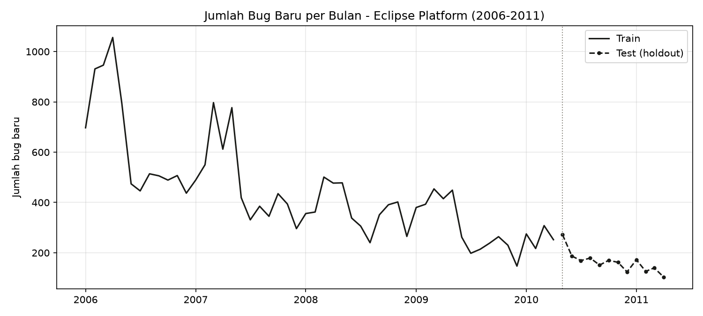
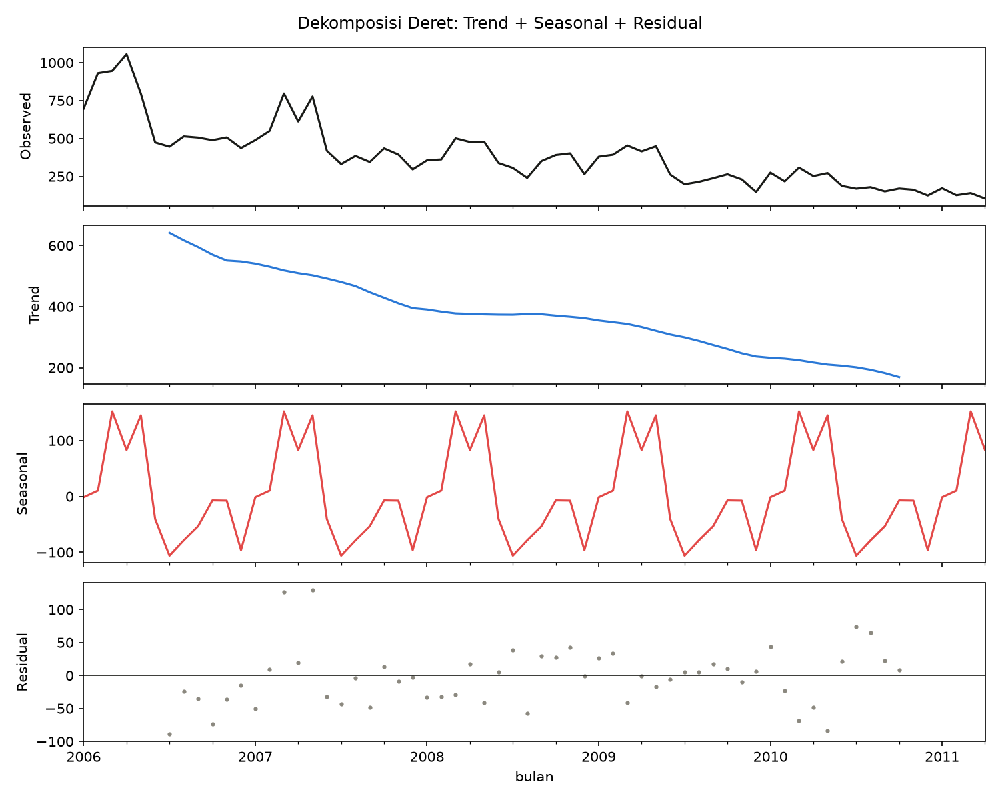
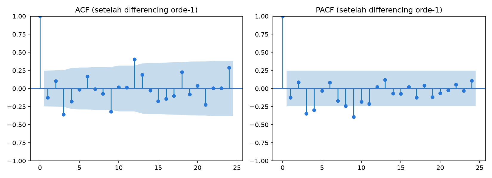
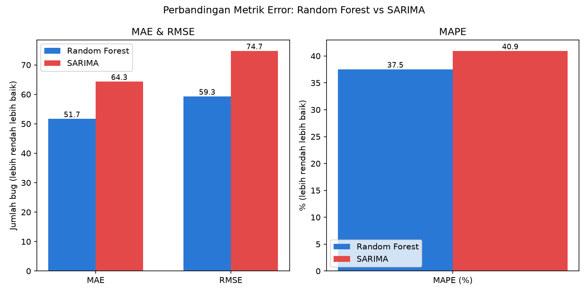
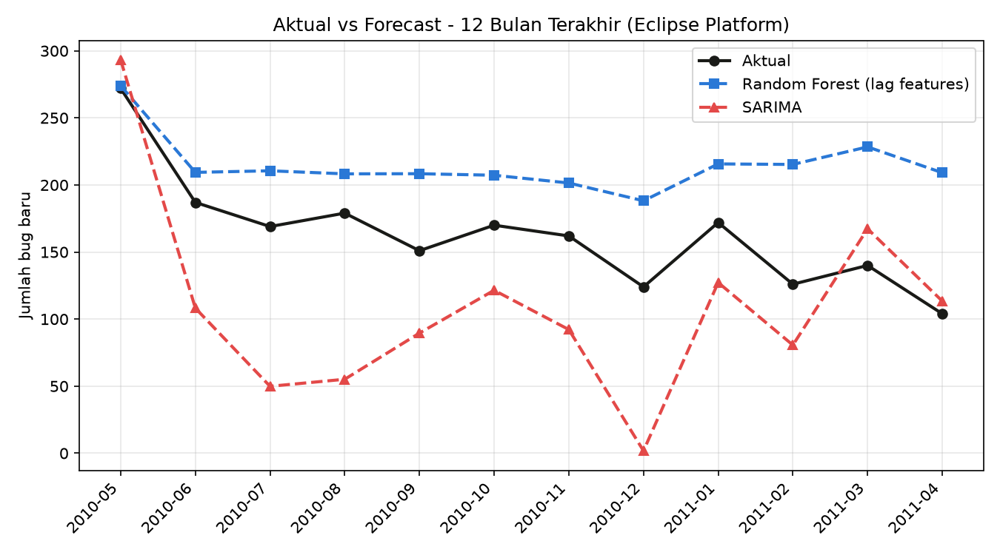
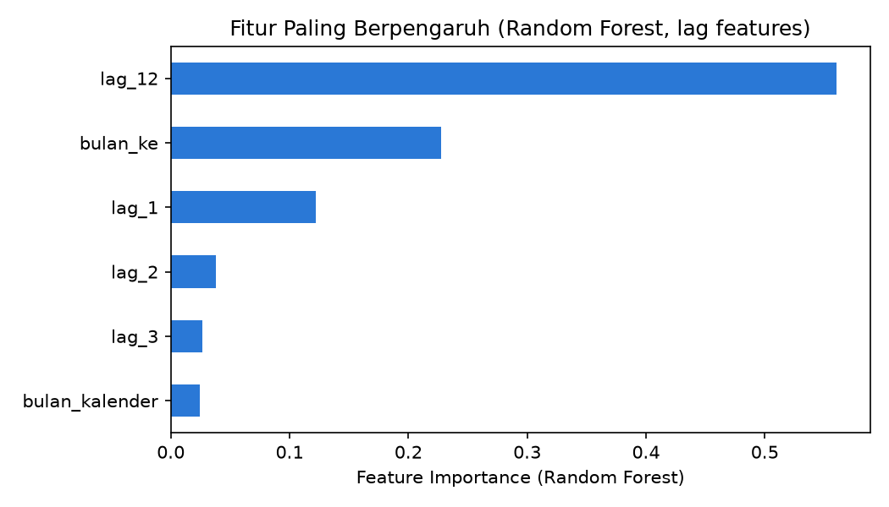

# Time Series Bug-Arrival Eclipse Platform: SARIMA vs Random Forest

## 1. Latar Belakang

Studi sebelumnya (`analysis/desharnais/`) menunjukkan Random Forest jauh
mengungguli ARIMA pada dataset Desharnais — namun itu terjadi karena
Desharnais **bukan** time series asli (81 proyek independen, sekadar
diurutkan berdasarkan tahun). Pertanyaan lanjutannya: bagaimana jika
datanya memang **benar-benar time series**?

Dataset yang dipakai di sini: **jumlah bug baru per bulan pada proyek
Eclipse Platform**, diturunkan dari *"The Mozilla and Eclipse Defect
Tracking Dataset"* (Ohira et al., MSR 2013) — 24.775 laporan bug nyata
dengan timestamp pembukaan, Januari 2006 – April 2011 (64 bulan, satu
proyek yang sama diamati berturut-turut). Ini adalah kandidat yang jauh
lebih sah untuk pendekatan time series dibanding Desharnais.

Sumber data: [github.com/ansymo/msr2013-bug_dataset](https://github.com/ansymo/msr2013-bug_dataset)

## 2. Eksplorasi & Uji Stasioneritas



Deret menunjukkan **tren menurun yang jelas** sepanjang 2006–2011 (dari
puncak >1.000 bug/bulan di awal 2006 menjadi <150 di awal 2011) — masuk
akal karena proyek Eclipse Platform yang matang cenderung makin stabil
dan makin sedikit bug baru ditemukan seiring waktu.

**Uji Augmented Dickey-Fuller (ADF):**

| Deret | ADF statistic | p-value | Stasioner? |
|---|---:|---:|:---:|
| Level (tanpa diff) | -1,285 | 0,636 | Tidak |
| Differencing orde-1 | -6,425 | 0,000 | **Ya** |

Deret level tidak stasioner (ada tren) tapi menjadi stasioner setelah
differencing orde-1 — pola klasik yang cocok dimodelkan ARIMA/SARIMA
dengan `d=1`.



Dekomposisi aditif (periode 12 bulan) memperlihatkan tiga komponen
dengan jelas:
- **Trend**: menurun monoton dari ~650 menjadi ~170.
- **Seasonal**: pola tahunan yang sangat konsisten berulang setiap
  tahun — lonjakan di pertengahan tahun (konsisten dengan siklus
  *"Simultaneous Release"* tahunan Eclipse yang mendorong lonjakan
  testing & pelaporan bug).
- **Residual**: relatif kecil dan tanpa pola sistematis tersisa.



ACF pada deret yang sudah di-diff menunjukkan lonjakan signifikan di
**lag 12** (~0,4, melewati pita signifikansi) — bukti autokorelasi
musiman tahunan yang nyata. **Ini adalah struktur temporal sungguhan
yang tidak mungkin ada pada dataset Desharnais** (proyek independen
tidak punya "lag 12 bulan sebelumnya" yang bermakna).

## 3. Metodologi Pemodelan

- **Split kronologis**: 52 bulan pertama untuk *training*, 12 bulan
  terakhir (Mei 2010 – April 2011) sebagai *holdout* — sama untuk kedua
  model.
- **SARIMA**: order dipilih otomatis lewat grid search AIC atas
  `(p,d,q)x(P,D,Q,12)`. Order terbaik: **SARIMA(2,1,1)(1,1,0)[12]**
  (AIC=284,2).
- **Random Forest**: dilatih dengan fitur lag (`lag_1, lag_2, lag_3,
  lag_12`), indeks tren (`bulan_ke`), dan bulan kalender
  (`bulan_kalender`). Forecast 12 bulan dilakukan **secara rekursif**
  (prediksi bulan sebelumnya dipakai sebagai lag untuk bulan berikutnya) —
  skema yang sama seperti forecasting time series pada umumnya.

## 4. Hasil

| Metrik | Random Forest | SARIMA |
|---|---:|---:|
| MAE | **51,7** | 64,3 |
| RMSE | **59,3** | 74,7 |
| MAPE (%) | **37,5%** | 40,9% |
| R² | -1,118 | -2,364 |







### Interpretasi

Menariknya, **Random Forest tetap sedikit lebih unggul di semua
metrik** — tapi alasannya sangat berbeda dari kasus Desharnais, dan
kedua model sama-sama gagal mencapai R² positif. Ini bukan berarti time
series "tidak berguna" di sini; polanya justru menunjukkan **dua mode
kegagalan yang berbeda**:

- **Random Forest** menghasilkan prediksi yang *stabil tapi bias* —
  konsisten memprediksi ~200-230 bug/bulan padahal aktualnya terus
  menurun ke ~100-170. `lag_12` adalah fitur terpenting (56%) diikuti
  `bulan_ke`/indeks tren (23%) — RF **berhasil mengenali pola musiman**,
  tapi model berbasis pohon keputusan **tidak bisa mengekstrapolasi
  tren** di luar rentang nilai yang pernah dilihat saat training. Karena
  12 bulan data uji mencatat level bug terendah sepanjang sejarah
  dataset, RF "buta" terhadap kemungkinan level serendah itu.
- **SARIMA** justru menangkap arah tren menurun dengan cukup baik, tapi
  forecast-nya **sangat berosilasi** (dari mendekati 0 di Des 2010
  hingga hampir 300 di Mei 2010) — komponen musiman `(1,1,0)[12]`
  kemungkinan overfit karena data training (52 bulan) hanya mencakup
  ~4,3 siklus tahunan penuh, jumlah yang minim untuk mengestimasi
  parameter musiman secara stabil.

**Kontras dengan studi Desharnais:**

| | Desharnais | Eclipse Bug Time Series |
|---|---|---|
| Struktur temporal asli | Tidak ada (proyek independen) | Ada (tren + musiman signifikan, terbukti lewat ADF/ACF/dekomposisi) |
| ARIMA/SARIMA vs RF | RF jauh lebih baik (R² 0,28 vs -0,26) | RF sedikit lebih baik (bukan karena SARIMA salah pendekatan, tapi karena data training kurang panjang & horizon test di luar rentang historis) |
| Penyebab utama | ARIMA tidak (dan memang tidak seharusnya) punya sinyal untuk dimanfaatkan | Sinyal time series terbukti nyata (ACF lag-12 signifikan), tapi kedua model kesulitan mengekstrapolasi ke level tak terpresedenkan |

## 5. Kesimpulan

1. **Dataset ini adalah contoh time series yang sah** untuk data proyek
   IT — berbeda dari Desharnais, ini satu proyek yang sama diamati
   berturut-turut, dengan tren dan musiman yang terbukti signifikan
   secara statistik (ADF, ACF, dekomposisi).
2. Namun **memiliki struktur time series yang nyata tidak otomatis
   membuat forecasting menjadi mudah atau membuat model time series
   "menang"**. Pada horizon uji ini, kedua pendekatan sama-sama gagal
   mencapai R² positif karena test period berada di luar rentang nilai
   yang pernah teramati saat training (masalah ekstrapolasi, bukan
   masalah pemilihan metode).
3. **Implikasi praktis untuk prediksi keterlambatan proyek IT**: jika
   tersedia riwayat periodik dari proyek yang sama (mis. laporan
   progres bulanan, backlog, velocity tim), pendekatan time series
   (SARIMA/Prophet) *layak dicoba* dan bisa melengkapi model berbasis
   fitur seperti Random Forest — tapi keduanya perlu diwaspadai saat
   memprediksi kondisi yang jauh berbeda dari riwayat yang pernah
   terekam. Kombinasi keduanya (mis. RF dengan fitur lag + indikator
   tren eksplisit, atau ensemble RF+SARIMA) sering kali lebih tangguh
   daripada mengandalkan satu pendekatan saja.

## 6. Cara Menjalankan Ulang

```bash
cd analysis/eclipse_bug_timeseries
python -m analysis.eclipse_bug_timeseries.prepare_data        # ekstrak XML -> CSV
python -m analysis.eclipse_bug_timeseries.time_series_analysis # analisis & modeling
```

Data sumber (`data/eclipse_platform_reports.xml`) diambil dari dataset
publik MSR 2013 (Ohira et al.) via
[ansymo/msr2013-bug_dataset](https://github.com/ansymo/msr2013-bug_dataset).
